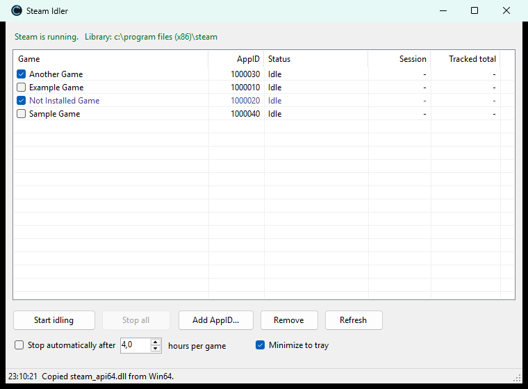

# Steam Idler

Accrue Steam playtime on games you own without launching them. Idle several games at
once, keep them running in the background, and stop automatically after a set number of
hours. Runs on Windows and macOS.

No installer, no runtime to download, no external dependencies. On Windows it builds with
the C# compiler that already ships with Windows. On macOS it builds with the Swift compiler
from the Xcode Command Line Tools.



## Quick start

### Windows

```powershell
git clone https://github.com/r33hAB/SteamIdler.git
cd SteamIdler
powershell -ExecutionPolicy Bypass -File build.ps1
.\bin\SteamIdler.exe
```

### macOS

Download `SteamIdler-v*-macos-universal.zip` from
[Releases](https://github.com/r33hAB/SteamIdler/releases), unzip it and move
`Steam Idler.app` to Applications. The app is not notarized by Apple, so macOS blocks it
until you clear the download flag once:

```sh
xattr -dr com.apple.quarantine "/Applications/Steam Idler.app"
```

Or build it yourself:

```sh
xcode-select --install    # once, unless Xcode or the Command Line Tools are already there
git clone https://github.com/r33hAB/SteamIdler.git
cd SteamIdler
./build.sh
open "/Applications/Steam Idler.app"
```

`build.sh` installs into `/Applications`; pass another folder to put it elsewhere
(`./build.sh ~/Applications`). Run it again to update. It quits a running copy first,
which stops whatever that copy was idling, and reopens it afterwards.

### Then

Start Steam and log in first, tick the games you want, then press **Start idling**.

Installed games are detected automatically from every Steam library drive. Games you own
but haven't installed can be added with **Add AppID...**. The AppID is the number in the
store URL (`store.steampowered.com/app/440/` → `440`). On a Mac this is also how you idle
games that have no Mac version, and the dialog accepts the whole store URL.

## How it works

Steam credits playtime to any process that has initialised the Steam API under a given
AppID. It does not check that the real game is running. Each idler process sets the
`SteamAppId` environment variable, calls `SteamAPI_Init` from `steam_api64.dll` (`libsteam_api.dylib` on macOS), and pumps
`SteamAPI_RunCallbacks` until told to stop. Steam ends the session the instant that process
exits.

### Why one process per game, not one thread per game

`steam_api64.dll` resolves the AppID **once, at init, per process**, and caches it. Every
thread inside a process therefore shares a single AppID, so threads fundamentally cannot
idle different games. One process per game is the only option.

`SteamIdler.exe` is a supervisor: it spawns a `SteamIdlerWorker.exe` per game, watches each
one, and reaps them on exit. Each worker independently watches the supervisor's PID and
terminates itself if the GUI dies, so you can never end up with orphaned processes silently
holding sessions open.

The macOS app works the same way: `Steam Idler.app` supervises one `SteamIdlerWorker` per
game from inside its bundle. Stopping a game sends the worker SIGTERM, and it calls
`SteamAPI_Shutdown` before exiting.

Steam stops accepting new sessions at roughly **32 concurrent apps** per account, which the
GUI enforces before starting anything.

## Features

- Idle many games simultaneously, each in its own supervised process
- Automatic library detection across all Steam library folders
- Manual AppIDs for games you own but haven't installed
- Per-game session timer plus a tracked total that persists between runs
- Optional auto-stop after N hours per game
- Minimize or close to the system tray while idling continues. On macOS, close the window
  and the app keeps idling in the Dock, with a badge counting the running games; click the
  Dock icon to bring the window back
- Single instance — launching the exe again restores the window instead of starting a second copy
- Stops everything automatically if Steam exits

## Honest limits

- **You must own the game.** `SteamAPI_Init` succeeds even for AppIDs you don't own — the
  local client opens a session quite happily — but Valve only credits playtime against a
  license you actually hold. A green "session open" row is *not* proof hours are being
  recorded.
- **Buying a game later does not backfill hours.** Playtime is credited server-side against
  your license. Idle something you don't own, buy it afterwards, and your playtime starts at
  zero.
- **Idled hours count toward the refund window.** After you buy a game, idling burns the
  2-hour refund limit exactly like real playtime does.
- **Hours only.** Nothing runs inside the game, so there is no XP, progression, or in-game
  advancement of any kind.
- **Item drops vary.** Trading card drops generally work. Games that grant items for
  playtime (TF2, Rust, CS) run their own server-side idle detection and have historically
  reduced or blocked drops for idled sessions.
- Steam must stay running and logged in.
- Windows: x64 with .NET Framework 4.x, both already present on Windows 10 and 11.
- macOS: 13 Ventura or later, Apple silicon or Intel. The Intel build is compiled but has
  only been run on Apple silicon so far.

## About `steam_api64.dll` and `libsteam_api.dylib`

The workers need Valve's `steam_api64.dll`. It is **not** distributed with this project —
it's Valve's proprietary redistributable and not mine to ship.

`build.ps1` copies it automatically out of a game already installed on your machine, and the
app does the same on first run if it's missing. If neither finds one, copy any
`steam_api64.dll` from a folder under `steamapps\common` into `bin\`.

On macOS nothing is copied. The Steam client ships its own universal `libsteam_api.dylib`
inside its app bundle, and the workers load it from there, so it keeps pace with Steam's
updates and no game has to be installed. If that copy is ever missing, the app falls back
to one from an installed Mac game.

## Project layout

| Path | Purpose |
| --- | --- |
| `src/MainForm.cs` | GUI, process supervision, timers, tray |
| `src/Worker.cs` | one instance per idling game; holds the Steam session open |
| `src/SteamLibrary.cs` | registry + `.acf` / `.vdf` parsing to find Steam and its games |
| `src/Config.cs` | flat key/value settings file |
| `src/AddAppForm.cs` | dialog for adding a game by AppID |
| `build.ps1` | compiles both exes with the in-box .NET Framework compiler |
| `macos/App/` | macOS app: window, process supervision, timers, library discovery (Swift) |
| `macos/Worker/main.swift` | macOS worker, one instance per idling game |
| `macos/make-icon.swift` | draws the app icon at build time, so no binary asset is committed |
| `build.sh` | builds a universal `Steam Idler.app` with the Swift compiler and installs it |

Generated at build or run time, and deliberately not committed: `bin/`, `steam_api64.dll`,
`SteamIdler.cfg`, `SteamIdler.error.log`.

On macOS, settings and tracked totals live in the defaults domain `com.r33hab.steamidler`
(`defaults read com.r33hab.steamidler`), and each worker's `steam_appid.txt` in
`~/Library/Application Support/SteamIdler/`.

The macOS app deliberately avoids SwiftUI's `@State`. In the macOS 27 SDK it is a macro
whose plugin ships with Xcode but not with the Command Line Tools, and `build.sh` must work
with those alone.

## Troubleshooting

| Symptom | Cause |
| --- | --- |
| "Steam is not running, or you are not logged in" | start Steam first |
| "This Steam account does not own that AppID" | newer SDKs reject unowned apps at init |
| "steam_api64.dll missing" | copy one from any folder under `steamapps\common` into `bin\` |
| Row stuck on `Connecting...` | Steam is still starting, or is running elevated while the app isn't |
| The window vanished | it's in the tray: run `SteamIdler.exe` again to bring it back |
| "libsteam_api.dylib not found" (macOS) | Steam isn't in `~/Library/Application Support/Steam`; install it and sign in once |
| The window vanished (macOS) | games are still idling; click the Dock icon to bring it back |

Unhandled errors are written to `bin\SteamIdler.error.log`. On macOS, crashes show up in
Console under Crash Reports.

## Licence

MIT — see [LICENSE](LICENSE).

Not affiliated with or endorsed by Valve. Steam is a trademark of Valve Corporation.
